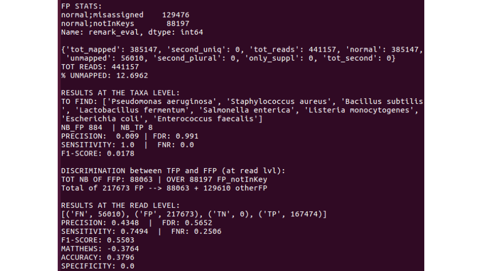
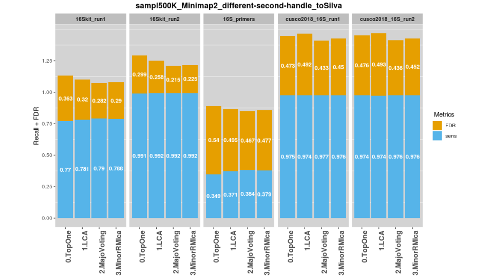

# Jan 2019: 6-months M2 (BIB) internship

 


<p align="center"></p>  

<br>

## Description of this respository
- This Github repository contains scripts developped within the scope of **ANR
ASTER project**. It aims to determine whether long-reads sequencing with
Oxford Nanopore Technology (ONT) are suitable in the context of targeted
metagenomics (16S-amplicons). <br>
It is composed of 4 python scripts (`0-solve_SILVA.py`, `1-assign_pipeline.py`, 
`2-prim_analysis.py`, `3-second_analysis.py`), and 2 R scripts 
(`make_stackbar.R`, `make_radar_plot.R`). All 6 are in the base directory and
Python modules are stored in the `src/` directory. <br>
- Proper usage helps can be produced for most Python scripts, using `-h | --help` 
option (expect for `0-solve_SILVA.py`). Example:
  ```
    Mapping statistics computation

    Usage:
      2-prim_analysis.py (-i <inFile>) (-l <taxoCut>) [-w <writeMap>]
      
    Options:
      -h --help                  help
      --version                  version of the script
      -i --inFile=input_file     input file
      -l --taxoCut=taxo_cutoff   cutoff for the taxonomic level
      -w --writeMap=write_map    Flag to either write (reads-vs-OTUs) mapping file [default: F] 
  ```

<br>

## Installation
- The Python (3.6.0) packages required are:
  ```
  matplotlib        2.2.3 or higher
  numpy             1.15.2 or higher
  biopython         1.72 or higher
  docopt            0.6.2 or higher
  pandas            0.22.0 or higher
  sklearn           0.17 or higher
  pysam             0.15.2 or higher
  ```
They can all be installed in once using the supplied `requirements.txt` file
with pip: <br>
`pip3 install -r requirements.txt` <br>
(or simply `pip install restOfCmd` if your `pip` runs Python 3)

- The R librairies required are:
```
  ggplot2
  dplyr
  reshape2
  fmsb
```

<br>

## WARNING - Before running any script
> Use of the taxonomic module:
>> Most scripts use the `ncbi_taxdump_utils.py` Python module, which needs 
2 dump files to be initialized (`names.dmp` and `nodes.dmp`). These 2 files 
(can be retrieved from NCBI ftp) need to be put in a `dump_files/` folder 
(at root directory). <br>
The hard-coded line for this parameter is at line 19 from `src/taxo_eval.py` 
module.

> Modification of `.conf` files:
>> Most scripts are associated to a `.conf` file (CSV format), avoiding 
hard-written paths. These files have to be adapted to your own configuration <br>
The generic patterns to specify a path are precised within each corresponding 
`.conf` file. <br>

<br>

## Usage
### Pre-processing
- The `0-solve_SILVA.py` script was dedicated to solve all issues linked to
taxonomy. So it contains several functions, that have to be called by 
modifying directly the 'main'. <br> 
- For example to run the function producing information about a given database:
```
    # MAIN:
    if __name__ == "__main__":
        stats_base('SILVA')

```
And then: `./solve_SILVA`

### Usage of `1-assign_pipeline.py`
- This script proceeds to taxonomic determination with either Centrifuge or 
Minimap2 against different possible databses (ZYMO, RRN, SILVA, NCBI_16S etc).
It aims to simplify nomenclature of the output file (SAM for Minimap2 or 
CSV for Centrifuge), to make output file easily manipulated by 
`2-prim_analysis.py` script. <br>
- List of features added within the name:


### Usage of `2-prim_analysis.py`
- This script also Currently
- Example of cmd:
`2-prim_analysis.py -i /path/to/your_fav_SAM.sam -l genus`


### Usage of `3-second_analysis.py`
This script basically performs relative abundance calculations. It takes as 
input a TSV, produced using several scripts from QIIME1. <br>
Once you activated a proper Anaconda environment containing QIIME1, the classic 
pipeline to obtain such file can be run with 
`./input_second.sh /path/to/your_fav_SAM.sam /path/ouput/directory`
(an usage for this Bash script can be found within it)

<br>

## Examples of results
- Example of stdout produced by `2-prim_analysis.py` script:


- Example of R plots that can be produced using R scripts:



## Features
- General pipeline to trim adapters ([Porechop](https://github.com/rrwick/Porechop)), 
detect chimeras ([yacrd](https://github.com/natir/yacrd)), proceed to taxonomic
determination (either Minimap2 or Centrifuge), against different possible
databases (ZYMO, RRN, SILVA or p_compressed, with Centrifuge only)
- Evalutation of performances after taxonomic assignation
- Computation of several metagenomic metrics


## Main contributor
- [Félix Vandermeeren](https://github.com/tetedange13)

## Troubleshootings
If you detect any problems or bugs, feel free to contact me.