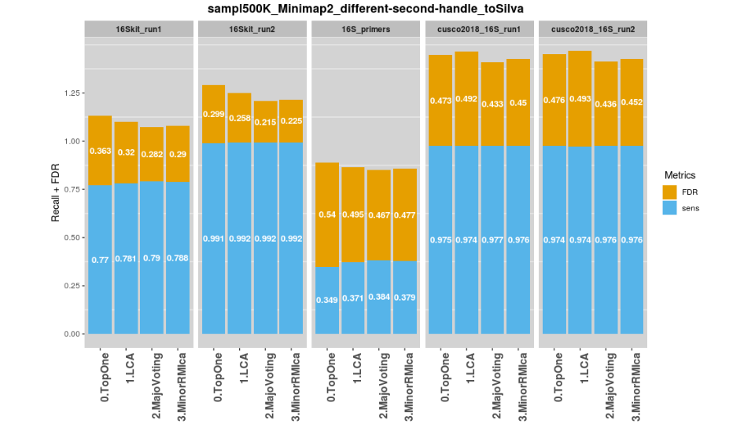

# Jan 2019: 6-months M2 (BIB) internship

 


<p align="center"></p>  

<br>

## Description of this respository
- This Github repository contains scripts developped within the scope of **ANR
ASTER project**. It aims to determine whether long-reads sequencing with
Oxford Nanopore Technology (ONT) are suitable in the context of targeted
metagenomics (16S-amplicons). <br>
It is composed of 4 python scripts (`0-solve_SILVA.py`, `1-assign_pipeline.py`, 
`2-prim_analysis.py`, `3-second_analysis.py`), and 2 R scripts 
(`make_stackbar.R`, `make_radar_plot.R`). All 6 are in the base directory and
Python modules are stored in the `src/` directory. <br>

- Proper usage helps can be produced for most Python scripts, using `-h | --help` 
option (expect for `0-solve_SILVA.py`). Example:
  ```
    Mapping statistics computation

    Usage:
      2-prim_analysis.py (-i <inFile>) (-l <taxoCut>) [-w <writeMap>]
      
    Options:
      -h --help                  help
      --version                  version of the script
      -i --inFile=input_file     input file
      -l --taxoCut=taxo_cutoff   cutoff for the taxonomic level
      -w --writeMap=write_map    Flag to either write (reads-vs-OTUs) mapping file [default: F] 
  ```

<br>

## Installation
- The Python (3.6.0) packages required are:
  ```
  matplotlib        2.2.3 or higher
  numpy             1.15.2 or higher
  biopython         1.72 or higher
  docopt            0.6.2 or higher
  pandas            0.22.0 or higher
  sklearn           0.17 or higher
  pysam             0.15.2 or higher
  ```
They can all be installed in once using the supplied `requirements.txt` file
with pip: <br>
`pip3 install -r requirements.txt` <br>
(or simply `pip install restOfCmd`, if your `pip` runs Python 3)

- The R librairies required are:
```
  ggplot2
  dplyr
  reshape2
  fmsb
```

<br>

## Building a custom Centrifuge index
Once Centrifuge is properly installed, you can **build a custom Centrifuge 
index** with the following commands:

1. Download NCBI "taxonomy" database dump files (`names.dmp` and `nodes.dmp`): <br>
`centrifuge-download -v -o ./ taxonomy` (can be reused for all Centrifuge index built)
1. Generate a proper `seqid2taxid` file (mapping sequence headers with their taxid),
being sure that present taxids are consistent with downloaded NCBI taxonomy
1. Build the custom index using both dump files and the “seqid2taxid” file:
`entrifuge-build --conversion-table seqid2taxid --taxonomy-tree nodes.dmp --name-table names.dmp ref_database.fa outPrefix`

<br>

## WARNING - Before running any script
> *Use of the taxonomic module:*
>> Most scripts use the `ncbi_taxdump_utils.py` Python module, which needs 
2 dump files to be initialized (`names.dmp` and `nodes.dmp`). These 2 files 
(can be retrieved from NCBI ftp) need to be put in a `dump_files/` folder 
(at root directory). <br>
The hard-coded line for this parameter is at line 19 of the `src/taxo_eval.py` 
module.

> *Modification of the `pipeline.conf` file:*
>> Most scripts need to have the location of certain files to work (for example 
of the Centrifuge index) to work. All this hard-written paths must be put into
the `pipeline.conf` configuration file (CSV format). This file has to be 
adapted to your own locations before running any Python script. <br>
The generic patterns to specify a path are precised within this `.conf` file. <br>

<br>

## Usages
### Pre-processing (usage of `0-solve_SILVA.py`)
- The `0-solve_SILVA.py` script was dedicated to solve all issues linked to
taxonomy. So it contains several functions, that have to be called by 
modifying directly the 'main'. <br> 
- For example to run the function producing information about a given database:
```
    # MAIN:
    if __name__ == "__main__":
        stats_base('SILVA')

```
And then: `./0-solve_SILVA.py` (if you are in the root directory of the repository)

### Usage of `1-assign_pipeline.py`
This script proceeds to taxonomic determination with either Centrifuge or 
Minimap2 against different possible databases (ZYMO, RRN, SILVA, NCBI_16S etc).
It aims to simplify nomenclature of the output file (SAM for Minimap2 or 
CSV for Centrifuge), to make output file easily manipulated by 
`2-prim_analysis.py` script. <br>

List of features added within the name:

- The database used, for example: 'your_fav_name*_toRrn*.\*' (with RRN database) <br>
The name of the database given **must not contain any '\_'**. The ideal is to 
use 'camelcase' style, something like that: 'pCompressed'.
- If Centrifuge is used: '*centri_*your_fav_name_toRrn.csv'

Each taxonomic determination produces at least a file containing assignations 
(.SAM or .CSV) and a .log file. An output directory can be specified with the
`-o | --outDir` option. Example of command: <br> `./1-assign_pipeline.py 
-i my_fav_file.fq -P minimap2 -t 20 -d silva -o ../3-deter_minimap2_second/`


### Usage of `2-prim_analysis.py`
- This script can currently handle 4 different input files:


1. SAM file, produced by Minimap2 (SAM produced with another program are not 
guaranted to be handled)
1. TSV file produced by Centrifuge
1. CSV file produced by WIMP (ONT commercial tool)
1. CSV file produced by EPI2ME-BLAST (ONT commercial tool) <br>

The extension of the file matters here, as the treatment will be different. With
 a SAM file, the script will write a CSV file after the SAM parsing 
(destination given by the `-o | --outDir` option. Like that the next time, the
script will  look directly (still in 'outDir') for this written CSV and time 
is saved. <br> Example of cmd:
`2-prim_analysis.py -i /path/to/your_fav_file.sam -l genus -o ./my_CSVs/`

To handle multi-hits, the **default way is 'minor_rm+LCA'**, but 3 other methods 
('topOne', 'majoVoting', 'LCA') can be used, by setting the proper line, at the
hard-coded section around line 650 of `2-prim_analysis.py` script. <br>
The same way, you can apply a **different filter on Centrifuge results**,
rather based on a ratio 'hitLength/queryLength' > 40% (currently, the cutoff on 
'hitLength' is fixed at 50, as described in Centrifuge's paper). The concerned  
section of code is around line 100 of the script. <br>
This script also performs a **'correction' with RRN database for *B. intestinalis*** 
(converted into *B. subtillis*), around line .


### Usage of `3-second_analysis.py`
- This script basically performs **relative abundance calculations**. It takes as 
input a TSV, produced using several scripts from [QIIME1](http://qiime.org/). <br>
Once you activated a proper **Anaconda environment containing QIIME1**, the classic 
pipeline to obtain such file can be run with 
`./input_second.sh /path/to/your_fav_SAM.sam /path/ouput/directory` <br>
(usage for this Bash script can be found within it). 

- This script **has to be run from root directory**, to have an access to the 
`metadat_files/` folder. This folder contains 'taxonomic metadata files', *i.e.*
a 2-colums TSV file, associating each taxid from this 'complete_lineage' with 
its SILVA-formatted taxonomy. <br>
Such 'taxo_metadata' file can be generated from a seqid2taxid file, using the 
`write_metadat_file(/path/to/seqid2taxid, name_DB)` function of the 
`./0-solve_SILVA.py` script.

### Usage of `R` scripts
Both scripts can be run giving a CSV as command-line argument: 
`./make_stackbar.R well_formatted_file.csv`. Examples of input csv can be found 
in `examples/`:

- Files `cusco2018_abund_vs-different-DB.csv` and 
`sampl500K_Minimap2_to-different-DB_SPECIES.csv` for `make_stackbar.R`)
- File `16Skit_run1_sampl500K_Minimap2_raw-vs-filt_toZymo_SPECIES.csv` for 
`make_radar_plot.R`

For `make_stackbar.R`, lines can represent either runs (*e.g.* '16Skit_run2' and 
'16Skit_run2') or conditions ('toMockDB'). The most important is the header, 
which has to be formatted as follow: "species-Name_runID" ('abundances mode') or 
"metric1_cond1" ('metrics mode'). The key point here being the underscore, that 
**must be present only once in each column name**, to properly separate each 'category'. <br>
In 'metrics mode', this script accepts 2 different metrics (normally FDR and recall).

The script `make_radar_plot.R` has been coded on the same principle, except that 
it aims to generate a 'radar plot', displaying a unique value (*e.g.* a relative abundance) 
for each species present (in our case: 8 bacteria from Zymo mock community + 
'misassigned' category) in columns and for several runs/conditions (lines).

<br>

## Examples of results
- Example of stdout produced by `2-prim_analysis.py` script:
<p align="center"></p>

- Example of R plots that can be produced using R scripts:
<p align="center"></p>

<br>

## Features
- [x] General pipeline to trim adapters ([Porechop](https://github.com/rrwick/Porechop)), 
detect chimeras ([yacrd](https://github.com/natir/yacrd)), proceed to taxonomic
determination (either Minimap2 or Centrifuge), against different possible
databases (ZYMO, RRN, SILVA or p_compressed, with Centrifuge only)
- [x] Evalutation of performances after taxonomic assignation
- [x] Computation of several metagenomic metrics

<br>

## Main contributor
- [Felix Vandermeeren](https://github.com/tetedange13)

<br>

## Troubleshootings
If you detect any problems or bugs, feel free to contact me.
